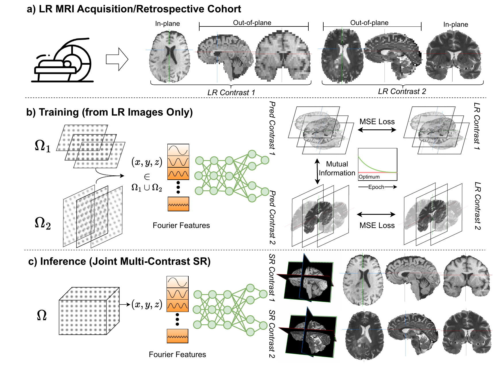

## Multi-contrast MRI Super-resolution via Implicit Neural Representations

[](https://doi.org/10.48550/arXiv.2303.15065) [](https://creativecommons.org/licenses/by-nc-sa/4.0/)



## Requirements


## Usage


## Citation and Contribution

Please cite this work if any of our code or ideas are helpful for your research.

```
@article{mcginnis2023multi,
  title={Multi-contrast MRI Super-resolution via Implicit Neural Representations},
  author={McGinnis, Julian and Shit, Suprosanna and Li, Hongwei Bran and Sideri-Lampretsa, Vasiliki and Graf, Robert and Dannecker, Maik and Pan, Jiazhen and Ans{\'o}, Nil Stolt and M{\"u}hlau, Mark and Kirschke, Jan S and others},
  journal={arXiv preprint arXiv:2303.15065},
  year={2023}
}
```

